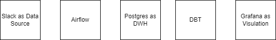
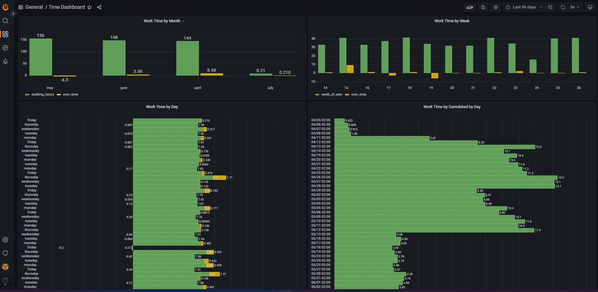
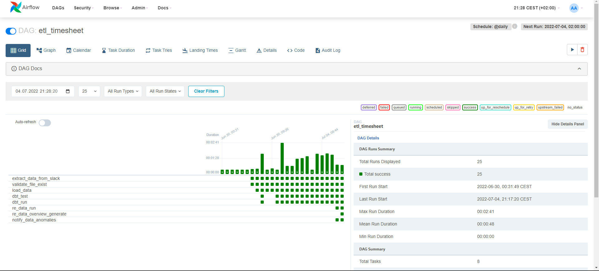
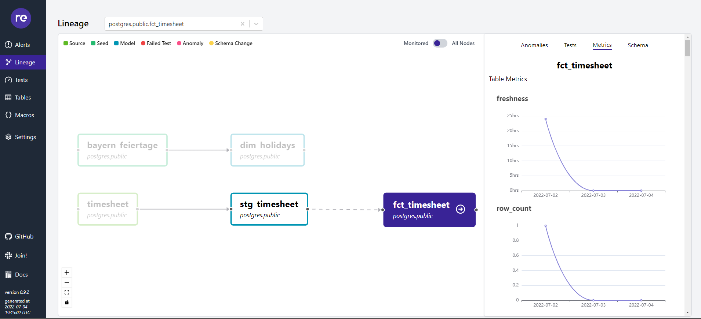

# ETL-Project Porfolio

## Architecture


## Prerequisites:
- Create .env file in parent folder with following content
```
AIRFLOW_UID=50000
SLACK_TOKEN="<Your Slack Token>"
POSTGRES_USER="airflow"
POSTGRES_PASSWORD="airflow"
POSTGRESS_DB="postgres"
```
## Start Stack
```
docker-compose up -d
```

## Destroy Stack
```
docker-compose down --remove-orphans --volumes
```

## Run RE_Data
```
re_data run --full-refresh --start-date <YYYY-MM-DD> --end-date <YYYY-MM-DD> --interval days:1
re_data overview generate
re_data overview serve
```

## Visualisation

### Url for Grafana
```
http://localhost:3000
```



## Orchestration
### Url for Airflow
```
http://localhost:8080
```



## RE_DATA - Data Observation
### Url for re_data
```
http://localhost:8085
```



