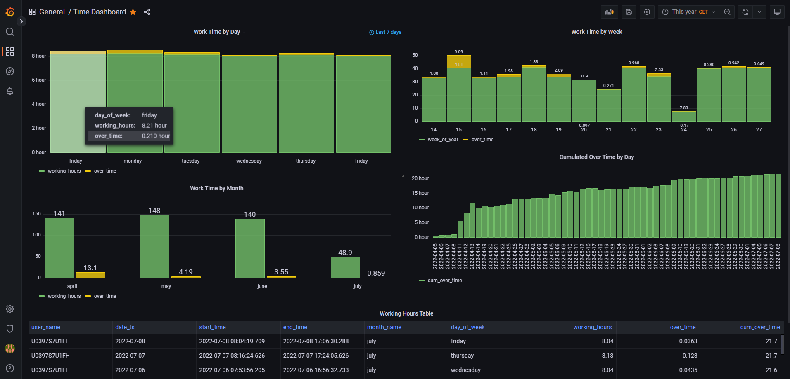

# ETL-Project Porfolio

## Architecture


## Visualisation


## RE_DATA - Data Reliability


## Prerequisites:
- Create .env file in parent folder with following content
```
AIRFLOW_UID=50000
SLACK_TOKEN="<Your Slack Token>"
POSTGRES_USER="airflow"
POSTGRES_PASSWORD="airflow"
POSTGRESS_DB="postgres"
```


## Start Stack
```
docker-compose up -d
```

## Destroy Stack
```
docker-compose down --remove-orphans --volumes
```